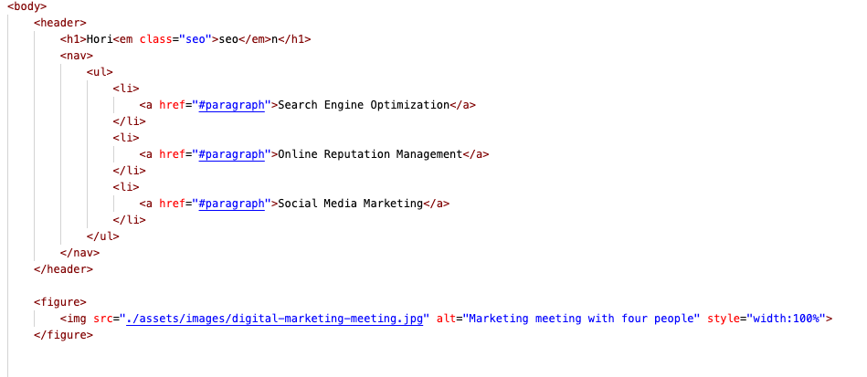
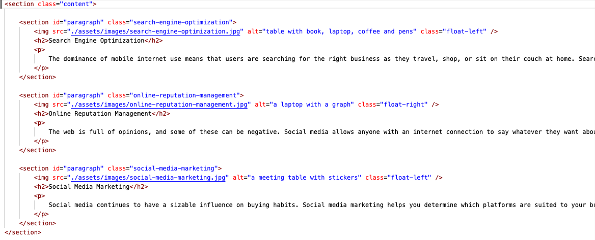
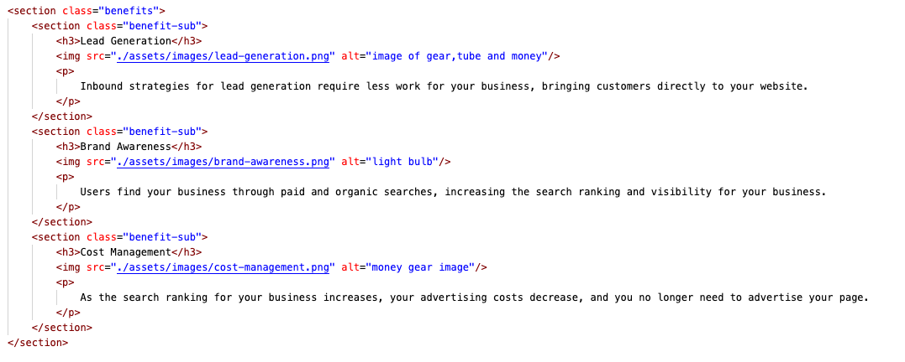

# homework-one
This a landing page for a Marketing company. I named the title of this page "Horiseon Marketing Soluutions" because the main purpose of the site is to provide marketing solutions to their clients. As per the instructions of the HW, I have re factored the code. 

## Getting Started

For starters I created a repository on github for code refactor, and git cloned it to my computer. added the hw materials to the file and pushed it to the git hub using git add . , git commit -m and git push origin main. 

### Refactored HTML 

1. I added semantic elements in the body of the code. (swtiched out the non semantic element (div) with semantic element(nav) and <sections> )
2. In addition in <h1> tag I removed the tag span which is a non semantic element and added and emphasis element <em>
3. In addition, in the body, I also changed the # to # paragraphs, because all three in the list acts the same (which is then used to shorten the css code but function the same way)
4. I added the background image in the html, with the figure tag, so I can make the site more accessible by adding alt to the img function
5. In the rest of the body, i changed (div) to (section) to make it semantic element
6. I also changed the id to paragraph to function interconnectly to the links in the nav
7. Within all the images in html, i added a alt function to make the sight more accessible for visually impaired people.
8. In the benefits section, I changed all the three classes to benefit sub, beacuse they function the same way, it makes it easier to code in css by shortening the lenght of css. 

### Refactored CSS

1. I changed all the header div to header nav. 
2. I changed the order of class benefit and class content
3. I changed all the id to paragraph and classes to benefit and sub to match the content in html

##Screenshot of the code 
  
  * screenshot of the header section
  
  
  
  * screenshot of section one 
  
  
  *screenshot of section two
  
  

## Built With

* [HTML](index.html)
* [CSS](style.css)

## Deployed Link
https://github.com/umeramalek/homework-one
* [See Live Site](#)
https://umeramalek.github.io/homework-one/

## Authors

* **YOUR NAME** 

- [Link to Portfolio Site](https://umeramalek.github.io/)
- [Link to Github](https://github.com/umeramalek)
- [Link to LinkedIn](www.linkedin.com/in/umeramalek)

## License

This project is licensed under the MIT License 

## Acknowledgments

* Hat tip to Jerome Chenette and the TA's for providing with the original code. 
